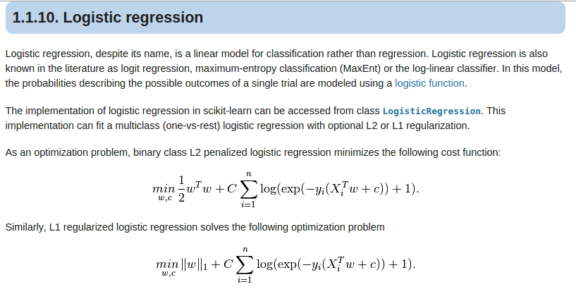

class:center, middle

# PyCon JP チュートリアル

---
## 全体の目次

* 機械学習入門
* NumPy/SciPyについて
* matplotlibを使った可視化
* scikit-learnを使った実験

---
## 注意事項

* Pythonのバージョンは3系を前提とします（ただし、2系でも動かせるようにするのは簡単）
* インストール（Python3/NumPy/SciPy/matplotlib/scikit-learn）はすでにインストールしてあるものと仮定します
* Pythonのプログラミングはすでにある程度できるものと仮定します（エキスパートである必要はない）

---
## 進め方

* 講義プラス演習の形で進めます
* サンプルコードはできるだけ自分の手で打ち込みましょう
    - 写経大事。理解した「つもり」にならないためにも
    - とはいっても、遅れそうなときは積極的にコピペしましょう
* サンプルコードは一行ずつ説明していきます
    - 「なぜこうなるのか」の説明を大事にしたい
* 数式はできるだけ使いません。なので、アルゴリズムの中身についてあまり突っ込みません（突っ込めません）。

---
## 今日やらないこと

* IPython（知ってる人は使ってもいいよ）
* Deep Learning（流行ってるけど...）

---
## 推薦図書（というか宣伝）


[http://bit.ly/yoseiml](http://bit.ly/yoseiml)

---
# 機械学習とは

データの集まりから学習し、法則性を見つけ出し、それを予測や意思決定に利用する仕組みのこと。
---
# 機械学習の種類

* 教師付き
    - 正解（ラベル）が与えられている
    - 訓練データが入力と出力（あるいは、特徴ベクトルとラベル）の組である
* 教師なし
    - 正解が与えられていない
    - 訓練データは入力（特徴ベクトル）のみである
* 半教師付き
    - 部分的に正解が与えられている

---
# 用語

* 学習（訓練）データ：機械学習システムに学習させるために入力するデータ
* 評価用データ：学習したモデルが正しく機能するかを評価するためのデータ

---
# 教師付き学習の例

* スパム判定
* 植物の分類（後述のあやめデータなど）
* 手書き文字の認識

---
# 教師なし学習の例

* ニュース記事の分類
* アクセスログの異常検知

---
class: center,middle

# NumPy/SciPy

---
# NumPy/SciPyとは？

* 数値計算・科学技術計算のためのライブラリ
* 今日やるのは行列の計算と、疎行列の計算のみです

---
# 表記法

サンプルコードには、REPLとプログラムファイルによる実行、両方が含まれます。

REPLの例：
```
>>> 3*5
15
```

プログラムファイルの例：
```python
#!/usr/bin/env python

print 3 * 5 # => 15
```

---
# 配列と行列

* NumPyには配列型がある（Python本体にあるのは「リスト型」）
* 2次元配列によって行列を表現するのが一般的である（要素には`a[i,j]`でアクセス）
* `matrix`型というのもあるのだが、一般にほとんど使われていない。

---

```
>>> import numpy as np
>>> a = np.array([[1,2],[3,4]])
>>> a
array([[1, 2],
       [3, 4]])
>>> b = np.arange(10)
>>> b
array([0, 1, 2, 3, 4, 5, 6, 7, 8, 9])
>>> c = b.reshape(2,5)
>>> c
array([[0, 1, 2, 3, 4],
       [5, 6, 7, 8, 9]])
```

`np.array`:リストから配列を作る<br/>
`np.arange`:等間隔の値を持つ配列を作る<br/>
`np.ndarray.reshape`:配列の形を変える


---
# 行列の演算

* 和・差には普通に「-」「+」を使う。
* 行列の積にはnp.dotをつかう
* 「*（アスタリスク）」は行列の積ではなく、要素ごとの積なので注意。

---

```
>>> a = np.arange(4).reshape(2,2)
>>> a
array([[0, 1],
       [2, 3]])
>>> b = np.arange(3,7).reshape(2,2)
>>> b
array([[3, 4],
       [5, 6]])
>>> a+b
array([[3, 5],
       [7, 9]])
>>> a.T
array([[0, 2],
       [1, 3]])
>>> a.T+b
array([[3, 6],
       [6, 9]])
>>> a-b
array([[-3, -3],
       [-3, -3]])
>>> np.dot(a,b)
array([[ 5,  6],
       [21, 26]])
>>> v = np.array([10,20])
>>> np.dot(a,v)
array([20, 80])
>>> np.dot(v,a)
array([40, 70])
```

---
# スライシング

インデックスの範囲をしていすることで、配列の一部を取り出すことができる。

例：
* 1次元配列`v`のインデックス2から3まで：`v[2:4]`
* 1次元配列`v`のインデックス2まで：`v[:3]`
* 1次元配列`v`のインデックス3以降：`v[3:]`
* 2次元行列`a`の0行目：`a[0,:]`
* 2次元行列`a`の1列目：`a[:,1]`

(注意：〜行目、〜列目はすべて0から数えています)


---
# インデクシング

角括弧の中にインデックスの配列を入れることで、複数の要素を取り出して新たな配列を作ることができる。

---
# ブロードキャスティング

配列のすべての要素に同時に同じ演算を作用させることができる。

---
### スライシングの例

```
>>> v=np.arange(10,15)
>>> v
array([10, 11, 12, 13, 14])
>>> v[2:4]
array([12, 13])
>>> v[:3]
array([10, 11, 12])
>>> v[3:]
array([13, 14])
>>> v[:-1]
array([10, 11, 12, 13])
>>> a=np.arange(1,5).reshape(2,2)
>>> a
array([[1, 2],
       [3, 4]])
>>> u=a[0,:]
>>> u
array([1, 2])
>>> u=a[:,1]
>>> u
array([2, 4])
```

---
### インデクシングとブロードキャスティングの例

```
>>> ii=np.array([2,3])
>>> v[ii]
array([12, 13])
>>> w=np.array([False,False,False,True,True])
>>> v[w]
array([13, 14])
>>> a*2
array([[2, 4],
       [6, 8]])
>>> np.exp(a)
array([[  2.71828183,   7.3890561 ],
       [ 20.08553692,  54.59815003]])
>>> v<13
array([ True,  True,  True, False, False], dtype=bool)
>>> v[v<13]
array([10, 11, 12])
```

---
# 行列の連結

* 2つの行列を横につなげる：`c_[a,b]`
* 2つの行列を立てにつなげる：`r_[a,b]`

---

```
>>> a=np.arange(6).reshape(2,3)
>>> b=np.arange(6,12).reshape(2,3)
>>> a
array([[0, 1, 2],
       [3, 4, 5]])
>>> b
array([[ 6,  7,  8],
       [ 9, 10, 11]])
>>> np.c_[a,b]
array([[ 0,  1,  2,  6,  7,  8],
       [ 3,  4,  5,  9, 10, 11]])
>>> np.r_[a,b]
array([[ 0,  1,  2],
       [ 3,  4,  5],
       [ 6,  7,  8],
       [ 9, 10, 11]])
>>> c=np.arange(3)
>>> d=np.arange(3,6)
>>> c
array([0, 1, 2])
>>> d
array([3, 4, 5])
>>> np.c_[c,d]
array([[0, 3],
       [1, 4],
       [2, 5]])
>>> np.r_[c,d]
array([0, 1, 2, 3, 4, 5])
```

---
# 疎行列とは

* ほとんどの要素が0であるような行列
* 内部的に0でない要素を覚えておくことで、メモリ消費と計算量を節約できる。

---
## scikit-learnの疎行列型

* `lil_matrix`はデータを設定するのに便利だが、計算には向いてない
* 計算するときには`csr_matrix`か`csc_matrx`を使う
* `csr_matrix`は行を取り出すのが高速で`csc_matrix`は列を取り出すのが高速
* `lil_matrix`を生成して値を設定し、その後`csr_matrix`か`csc_matrx`に変換して計算するのが一般的

---

```
>>> from scipy import sparse
>>> a=sparse.lil_matrix((5,5))
>>> a[0,0]=1; a[1,2]=2; a[3,4]=3; a[4,4]=4
>>> a
<5x5 sparse matrix of type '<class 'numpy.float64'>'
	with 4 stored elements in LInked List format>
>>> a.todense()
matrix([[ 1.,  0.,  0.,  0.,  0.],
        [ 0.,  0.,  2.,  0.,  0.],
        [ 0.,  0.,  0.,  0.,  0.],
        [ 0.,  0.,  0.,  0.,  3.],
        [ 0.,  0.,  0.,  0.,  4.]])
>>> b=a.tocsr()
>>> b
<5x5 sparse matrix of type '<class 'numpy.float64'>'
	with 4 stored elements in Compressed Sparse Row format>
>>> b.getrow(1).todense()
matrix([[ 0.,  0.,  2.,  0.,  0.]])
>>> v=np.array([1,2,3,4,5])
>>> a.dot(v)
array([  1.,   6.,   0.,  15.,  20.])
```

---
class:center,middle

# matplotlib

---
# matplotlibとは？

グラフ描画、データ可視化のためのライブラリ

---
# グラフ描画の基本

```
>>> import matplotlib.pyplot as plt
```

折れ線グラフを描くには、`x`にxの値の配列（リスト）、`y`にyの値の配列（リスト）を代入して：
```
plt.plot(x,y)
```

これだけだと何も表示されない。実際にグラフを表示するには：
```
plt.show()
```

---
### 折れ線グラフの例

```
>>> import matplotlib.pyplot as plt
>>> x=[1,2,3,4]
>>> y=[3,5,4,7]
>>> plt.plot(x,y)
[<matplotlib.lines.Line2D object at 0x108eebe48>]
>>> plt.show()
```


---

では、このような「曲線」を描くには？


x方向の刻み幅を細かくすれば良い。

---
# 刻むための２つの方法

区間[0,1]を刻んでみよう。

方法1：
```
>>> np.arange(0,1,0.1)
array([ 0. ,  0.1,  0.2,  0.3,  0.4,  0.5,  0.6,  0.7,  0.8,  0.9])
```
「0から1を0.1ごとに刻め」

方法2：
```
>>> np.linspace(0,1,10)
array([ 0.        ,  0.11111111,  0.22222222,  0.33333333,  0.44444444,
        0.55555556,  0.66666667,  0.77777778,  0.88888889,  1.        ])
```
「0から1まで等間隔に10個の点を取り出せ(区間数は9、植木算)」

---
# 曲線グラフ

```
>>> x=np.linspace(-5,5,100)
>>> y=x**2 # ブロードキャスティング
>>> plt.plot(x,y)
[<matplotlib.lines.Line2D object at 0x10e9d0048>]
>>> plt.show()
```


100くらいに刻めば人間の目には曲線に見える（わりとてきとー）
---
# 等高線のための準備

* meshgrid(): メッシュを作成する
* ravel(): 多次元配列を一次元配列に変換する

```
>>> x=np.array([1,2,3])
>>> y=np.array([4,5,6])
>>> X,Y=np.meshgrid(x,y)
>>> X
array([[1, 2, 3],
       [1, 2, 3],
       [1, 2, 3]])
>>> Y
array([[4, 4, 4],
       [5, 5, 5],
       [6, 6, 6]])
>>> X.ravel()
array([1, 2, 3, 1, 2, 3, 1, 2, 3])
>>> Y.ravel()
array([4, 4, 4, 5, 5, 5, 6, 6, 6])
```

---
# 等高線

```
>>> import numpy as np
>>> import matplotlib.pyplot as plt
>>> x=np.linspace(-5,5,200)
>>> y=np.linspace(-5,5,200)
>>> X,Y=np.meshgrid(x,y)
>>> Z=X.ravel()**2-Y.ravel()**2
>>> plt.contourf(X,Y,Z.reshape(X.shape))
<matplotlib.contour.QuadContourSet object at 0x104bb2048>
>>> plt.show()
```

---
class:middle,center

## （いよいよ）
# scikit-learn

---
# 線形回帰

---
```python
import numpy as np
import matplotlib.pyplot as plt
from sklearn import linear_model, datasets

# 乱数によりデータを生成
np.random.seed(0)
regdata = datasets.make_regression(100, 1, noise=20.0)

# 学習を行いモデルのパラメータを表示
lin = linear_model.LinearRegression()
lin.fit(regdata[0], regdata[1])
print("coef and intercept :", lin.coef_, lin.intercept_)
print("score :", lin.score(regdata[0], regdata[1]))

# グラフを描画
xr = [-2.5, 2.5]
plt.plot(xr, lin.coef_ * xr + lin.intercept_)
plt.scatter(regdata[0], regdata[1])

plt.show()
```

---
## 特徴ベクトルが多次元の場合（糖尿病データ）

```python
from sklearn import linear_model, datasets

# データの読み込み
diabetes = datasets.load_diabetes()

# データを訓練用と評価用に分ける
data_train = diabetes.data[:-20]
target_train = diabetes.target[:-20]
data_test = diabetes.data[-20:]
target_test = diabetes.target[-20:]

# 学習させる
lin = linear_model.LinearRegression()
lin.fit(data_train, target_train)

# 当てはまり度合いを表示
print("Score :", lin.score(data_test, target_test))

# 最初の評価用データについて結果を予想して、実際の値と並べて表示
print("Prediction :", lin.predict(data_test[0]))  # 予想
print("Actual value :", target_test[0])  # 実際の値
```

---
## データ形式


他のデータも大体このような形式。

`data`は各行が各サンプルに対応、それぞれのラベルが`target`の要素。`data`のサイズが$n\times m$のとき、`target`のサイズは$n$になる。

---
## scikit-learnの一般的な使い方

教師あり学習
```
    model.fit(data,target)
    result = model.predict(test_data)
```

教師なし学習
```
    model.fit(data)
```

---

# ロジスティック回帰

二値分類の予測手法。

```python
import sklearn.datasets as datasets
from sklearn.linear_model import LogisticRegression
from sklearn import cross_validation

# データの読み込み
iris = datasets.load_iris()

# 種類が2であるものを捨てる
data = iris.data[iris.target != 2]
target = iris.target[iris.target != 2]

# ロジスティック回帰による学習と交差検定による評価
logi = LogisticRegression()
scores = cross_validation.cross_val_score(logi, data, target, cv=5)

# 結果を表示する
print(scores)
```
---
### 交差検定（クロスバリデーション）

データを$n$個に分割して、そのうちの一つを評価用に、それ以外を訓練用に使うということを繰り返す手法。
（図を入れる）

データが少ない時に有効。

---
コンストラクタの引数を変えてみよう

```python
logi = LogisticRegression(C=0.002)
```

```python
logi = LogisticRegression(C=0.001)
```

何が起こるか？

この`C`ってどういう意味？

---
# パラメータとハイパーパラメータ

* パラメータ：学習の過程で変化していくもの
* ハイパーパラメータ：事前に一つ決めておいて、学習の途中では変わらないもの

```python
logi = LogisticRegression(C=0.001)
```
この`C`はハイパーパラメータ

ではこの`C`の意味は？→ドキュメント参照

---
## scikit-learnのドキュメント



という数式がわかってなくても、これがハイパーパラメータであることがわかれば、いろいろ試してみていいものを選ぶべきということがわかる。

もちろん、数式をわかっているほうがあたりがつけやすいというアドバンテージがある。

---
# サポートベクターマシン（SVM）

多値分類に有効な手法。

```python
from sklearn import datasets
from sklearn import svm
from sklearn import cross_validation

# データの読み込み
iris = datasets.load_iris()

# 学習
svc = svm.SVC()
scores = cross_validation.cross_val_score(svc, iris.data, iris.target, cv=5)

# 結果表示
print(scores)
print("Accuracy:", scores.mean())
```

---
# 主成分分析（PCA）

* 点列が「できるだけバラける」平面（部分空間）への射影
* 特異値分解などのアルゴリズムを利用

---

点列がバラける空間への射影をした上での分類の図示：
```python
from sklearn import datasets
from sklearn import svm
from sklearn.decomposition import PCA
import numpy as np
import matplotlib.pyplot as plt

# データの読み込み
iris = datasets.load_iris()

# PCAによるデータ変換
pca = PCA(n_components=2)
data = pca.fit(iris.data).transform(iris.data)

# メッシュ作成
datamax = data.max(axis=0) + 1
datamin = data.min(axis=0) - 1
n = 200
X, Y = np.meshgrid(np.linspace(datamin[0], datamax[0], n),
                   np.linspace(datamin[1], datamax[1], n))

# 分類
svc = svm.SVC()
svc.fit(data, iris.target)
Z = svc.predict(np.c_[X.ravel(), Y.ravel()])
```
(次のページに続く）

---

```python
# 描画
plt.contourf(
    X, Y, Z.reshape(X.shape), levels=[-0.5, 0.5, 1.5, 2.5],
    colors=["r", "g", "b"])
for i, c in zip([0, 1, 2], ["r", "g", "b"]):
    d = data[iris.target == i]
    plt.scatter(d[:, 0], d[:, 1], c=c)
plt.show()
```

---
### ハイパーパラメータをいじってみよう

まずはドキュメントを見てみる　→いろいろとややこしい

* kernel functionを選べる　→kernel functionってなに？
* kernel functionによって有効なパラメーが違う　→数式を参照

という難しい話を忘れて、ひとつだけいじってみます。

---

~~~python
svc = svm.SVC(C=100)
~~~

~~~python
svc = svm.SVC(C=100000)
~~~

こうするとどうなるか？

---
## 過学習

訓練データが完璧に分類できていればいいのか？

No! 訓練データは正しく計算できるが、他のデータが来たら正しく分類できなくなる可能性も。この状態を過学習（オーバーフィッティング）と呼ぶ。

過学習を防ぐには？
* 可視化して常識（またはドメイン知識）を働かせる（訂正評価）
* 交差検定が有効なことも

---
# KMeans法

* 教師なし学習
* 空間上の点列を分類する

---

```python
import numpy as np
import matplotlib.pyplot as plt
from sklearn.cluster import KMeans

# データの生成
np.random.seed(0)
X = np.r_[np.random.randn(30, 2) + [2, 2],
          np.random.randn(30, 2) + [0, -2],
          np.random.randn(30, 2) + [-2, 2]]

# 学習
kmeans = KMeans(n_clusters=3)
kmeans.fit(X)

# 描画
colors = ["r", "g", "b"]
for i in range(3):
    xx = X[kmeans.labels_ == i]
    plt.scatter(xx[:, 0], xx[:, 1], c=colors[i])
plt.show()
```

---
## 疎行列を使った例

MovieLensのデータ（ml-100k）を使って、似たような映画をまとめてみる。
```python
from sklearn.cluster import KMeans
from scipy import sparse

# 嗜好データの読み込み
data = []
max_user = 0
max_item = 0
for line in open("u.data"):
    a = line.rstrip().split("\t")
    user = int(a[0])
    item = int(a[1])
    rate = int(a[2])
    data.append((user, item, rate))
    if user > max_user:
        max_user = user
    if item > max_item:
        max_item = item

# 疎行列への設定
mat = sparse.lil_matrix((max_item, max_user))
for u, i, r in data:
    mat[i - 1, u - 1] = r

# 映画名の読み込み
movies = {}
for line in open("u.item"):
    a = line.rstrip().split("|")
    movies[int(a[0])] = a[1]
```
---
（続き）
```python
# クラスタリング
kmeans = KMeans(n_clusters=20)
kmeans.fit(mat)

clusters = [[] for _ in range(20)]
for i, label in enumerate(kmeans.labels_):
    clusters[label].append(movies[i + 1])

# クラスタのサイズ順（昇順）に表示
clusters = sorted(clusters, key=len)
for i in range(20):
    print("-" * 60)
    for m in clusters[i]:
        print(m)
```
---
実行結果（抜粋）

```
------------------------------------------------------------
Star Wars (1977)
Return of the Jedi (1983)
------------------------------------------------------------
Fargo (1996)
Godfather, The (1972)
------------------------------------------------------------
Contact (1997)
Scream (1996)
------------------------------------------------------------
Mighty Aphrodite (1995)
Postino, Il (1994)
Cold Comfort Farm (1995)
Lone Star (1996)
Big Night (1996)
Sense and Sensibility (1995)
Emma (1996)
Secrets & Lies (1996)
------------------------------------------------------------
Devil's Own, The (1997)
Full Monty, The (1997)
English Patient, The (1996)
Liar Liar (1997)
Air Force One (1997)
L.A. Confidential (1997)
Titanic (1997)
Conspiracy Theory (1997)
Saint, The (1997)
```
---
（続き）
```
------------------------------------------------------------
Toy Story (1995)
Twelve Monkeys (1995)
Birdcage, The (1996)
Rock, The (1996)
Twister (1996)
Independence Day (ID4) (1996)
Willy Wonka and the Chocolate Factory (1971)
Star Trek: First Contact (1996)
Men in Black (1997)
Mission: Impossible (1996)
------------------------------------------------------------
Pulp Fiction (1994)
Blade Runner (1982)
Terminator 2: Judgment Day (1991)
Silence of the Lambs, The (1991)
Monty Python and the Holy Grail (1974)
Empire Strikes Back, The (1980)
Princess Bride, The (1987)
Raiders of the Lost Ark (1981)
Aliens (1986)
Alien (1979)
Terminator, The (1984)
------------------------------------------------------------
```

---
## 時間があまったらやってみる

* カリフォルニア家賃データ
* 手書き数字データ
* 顔画像データ

---
# まとめ

* 機械学習関係ライブラリを、使うだけなら簡単
* 評価の仕組みも用意してある
* とにかくデータを可視化して「観察してみる」の大事
* matplotlibを使いこなせると強い
* ギリギリまでチューニングしたいとか、新たなアルゴリズムを試したいというときに、内部アルゴリズムを含めて知っていることはメリットに

