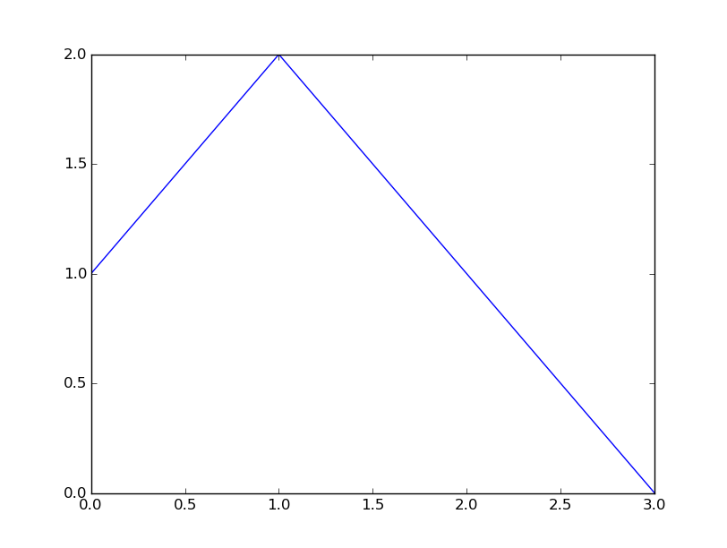

# はじめに

ここでは、PyCon JP 2015チュートリアル「Pythonを使った機械学習入門」に向けて、必要な環境（Python3, NumPy, SciPy, matplotlib, scikit-learn）を構築するための方法を説明します。書籍「[データサイエンティスト養成読本 機械学習入門編](http://www.amazon.co.jp/%E3%83%87%E3%83%BC%E3%82%BF%E3%82%B5%E3%82%A4%E3%82%A8%E3%83%B3%E3%83%86%E3%82%A3%E3%82%B9%E3%83%88%E9%A4%8A%E6%88%90%E8%AA%AD%E6%9C%AC-%E6%A9%9F%E6%A2%B0%E5%AD%A6%E7%BF%92%E5%85%A5%E9%96%80%E7%B7%A8-Software-Design-plus/dp/toc/4774176311」)に書いた内容をベースにしていますが、内容には違いがあります。

LinuxおよびMacへのインストールについては、pyenvというツールを利用します。pyenvについては、後述します。利用しているOSに対応する説明に沿ってインストールした後に、最後の「動作確認」を実行して確認してください。

ここではpyenvとpipを使ってNumPy/SciPy/matplotlib/scikit-learnを個別のパッケージとしてインストールしますが、これ以外にも方法はいくつか考えられます。Minicondaをベースにした方法については、「[Pythonで機械学習アプリケーションの開発環境を構築する](http://qiita.com/icoxfog417/items/950b8af9100b64c0d8f9)」を参照してください。

本ドキュメント執筆時点でPythonのバージョン3.5.0がリリースされていますが、筆者が動作を確認していないことと、pyenvが未対応なことにより、ここでは3.4.3をインストールします。

# LinuxまたはMacへのインストール

ここではLinux (Ubuntu）とMac（OS X）へのインストール方法を説明します。LinuxもMacも、OSのインストール時に標準でPython 2が入っていますので、pyenvを使ってそこに追加でPython3を入れる方法を説明します。

## pyenvのインストール(Linux)

まずpyenvのインストールですが、ここだけLinux（Ubuntu）の場合とMacの場合で異なります。それ以降はLinuxとMacで共通です。

pyenvは、Ubuntuのaptパッケージとして存在しないので、GitHubからダウンロードします。次のコマンドを実行します。
```
> git clone https://github.com/yyuu/pyenv ~/.pyenv
```
すると、~/.pyenvにプログラムがコピーされます。
次に依存ライブラリをインストールします。ターミナルから次のように入力します。
```
> sudo apt-get install -y make build-essential libssl-dev zlib1g-dev libbz2-dev
> sudo apt-get install -y libreadline-dev libsqlite3-dev wget curl llvm
```
また、次はpyenvというより、NumPy、SciPy、matplotlibのインストールに必要なパッケージなのですが、ついでにここでインストールします。
```
> sudo apt-get install -y libfreetype6-dev libblas-dev liblapack-dev gfortran tk-dev
```

## pyenvのインストール(Mac)

Macの場合もLinuxの場合と同様にGitHubからダウンロードすることもできます。ここではもっと簡単にパッケージ管理システムであるHomeBrewを使ってインストールします。HomeBrewについての詳しい説明はしませんが、インストール方法などの詳細は[http://brew.sh/index_ja.html](http://brew.sh/index_ja.html)を参照してください。HomeBrewがインストールされた状態で、ターミナルから次を入力します。
```
> brew install pyenv
```

## 設定ファイル（LinuxとMacに共通）

次にシェルの設定ファイルを変更して、パスを通すなどの設定をします。使っているシェルに合わせて、`.bash_profile`や`.zshenv`などを編集して次の行を追加します。
```
export PYENV_ROOT="$HOME/.pyenv"
export PATH="$PYENV_ROOT/bin:$PATH"
eval "$(pyenv init -)"
```
そしてターミナルを開き直せばOKです。動作確認のためターミナルから次のように入力します。

```
> pyenv version
```
次のように出力されれば正常に動いています。
```
> system (set by /home/hoge/.pyenv/version)
```

## Pythonのインストール
次にPython3をインストールして、Python3が動くように切り替えます。ここではバージョン3.4.3をインストールしますが、ほかにインストール可能なバージョンは、次のようにすれば一覧が出てきます。
```
> pyenv install --list
```
インストールするには次のように入力します。
```
> pyenv install 3.4.3
```
インストールにはしばらく時間がかかります。終わったら次のように入力してバージョンを3.4.3に切り替えます。
```
> pyenv global 3.4.3
> pyenv rehash
```
試しに`python --version`と入力するとバージョンが表示されるはずです。

最後にNumPy、SciPy、matplotlib、scikit-learnのインストールです。次の5行を入力してください。
```
> pip install --upgrade pip
> pip install numpy
> pip install scipy
> pip install matplotlib
> pip install scikit-learn
```

> 
# Windowsへのインストール

ここでは、Windowsへのインストールについて説明します。以下は64ビット版のバージョン3.4.3をインストールする方法ですが、。まずは次のURLからPythonのバージョン3.4.3のインストールイメージ「Windows x86-64 MSI installer」をダウンロードして実行します。

[https://www.python.org/downloads/windows/](https://www.python.org/downloads/windows/)

## ライブラリのインストール

LinuxとMacのときのようにpipでNumPyやSciPyを入れようとすると、開発環境が必要になり面倒なので、バイナリ版をインストールします。exe形式のインストーラはSourceForgeにあるのですが、適用できるPythonのバージョンが限られていて、とくに64ビット版には適合するものがないという問題があります。ここでは、次のURLから私家版とも言えるChristoph Gohlke氏がビルドしたものを使います。

（[http://www.lfd.uci.edu/~gohlke/pythonlibs/](http://www.lfd.uci.edu/~gohlke/pythonlibs/)）

まずGohlke氏のページに行って、「numpy‑1.9.2+mkl‑cp34‑none‑win_amd64.whl」と「scipy‑0.15.1‑cp34‑none‑win_amd64.whl」をダウンロードします。もしインストールしたPythonのバージョンが3.4.3の64ビット版以外のとき、ここではそのバージョンに応じたものをダウンロードしてください。このファイル名の「cp34」の34がPythonのバージョンを示します。

そして、これらのwhlファイルがある場所に`cd`して、次のようにすればNumPyとSciPyがインストールされます。

```
> pip install numpy‑1.9.2+mkl‑cp34‑none‑win_amd64.whl
> pip install scipy‑0.15.1‑cp34‑none‑win_amd64.whl
```

続いて、matplotlibとscikit-learnのインストールにはpipを使います。コマンドラインから次のように入力します。
```
> pip install matplotlib
> pip install scikit-learn
```

# pyenvについて

LinuxとMacへのインストールでは、pyenvというツールを使ってインストールをしました。このツールについて、知らないでいると混乱を招くかもしれないので簡単に説明します。

pyenvは、複数のPythonのバージョンを共存させるためのツールです。LinuxとMacではPython 2がすでに入っているので、そこにPython 3を共存させるためにpyenvを使った方法を紹介しました。pyenvでPython 3をインストールした状態で、コマンドラインから
```
> which python
```
と入力すると、`$HOME/.pyenv/shims/python`（`$HOME`はユーザのホームディレクトリ）と表示されると思います。つまり、pyenvはホームディレクトリ内に仮想的なPython環境を作ってインストールしてくれます。また、後述するpipもホームディレクトリ内にパッケージをインストールします。

このようなにpyenvによる仮想的な開発環境は、Pythonの一般的な開発環境とは異なります。Web記事などを真似して本特集の範囲外のライブラリを設定する場合は注意してください。pipを使ってインストールしている限りは、それほど気にせずにそのままできるはずです。

pyenvがインストールされている状態で次のように入力すると、現在使用可能なPythonのバージョン一覧が表示されます。
```
> pyenv versions
```
「LinuxまたはMacへのインストール」で説明したとおりにインストールしていれば、`3.5.0`以外に`system`と表示されると思います。この`system`がシステムに最初から入っているバージョンです。現在使われているバージョンの先頭に`*`（アスタリスク）が表示されているはずです。ここでバージョンをsystem（つまりPython 2）に切り替えたいときは次のように入力します。
```
> pyenv global system
```

pyenvの使い方の詳細は次のように入力し、出てくるヘルプ画面を見てください。

```
> pyenv
```

# 動作確認
ここでは、numpy/scipy/matplotlib/scikit-learnが正しくインストールされたかチェックする方法について説明します。

次のプログラムを入力して、ファイル`check.py`として保存します（間違えないようにコピーアンドペーストしてください）。

```
import numpy as np
from scipy import sparse
import matplotlib.pyplot as plt
from sklearn import svm

w = np.array([[0, 1], [1, 2], [2, 1]])
a = sparse.lil_matrix((3, 3))
a[0, 0] = a[1, 1] = a[2, 2] = 1
x = a.dot(w)
y = np.arange(3)
svc = svm.SVC().fit(x, y)
x = np.r_[x, np.array([[3, svc.predict(np.array([[0, 0]]))]])]
plt.plot(x[:, 0], x[:, 1])
plt.show()
```

そして、コマンドラインから実行します。
```
> python check.py
```

次のような画面が表示されればOKです。


